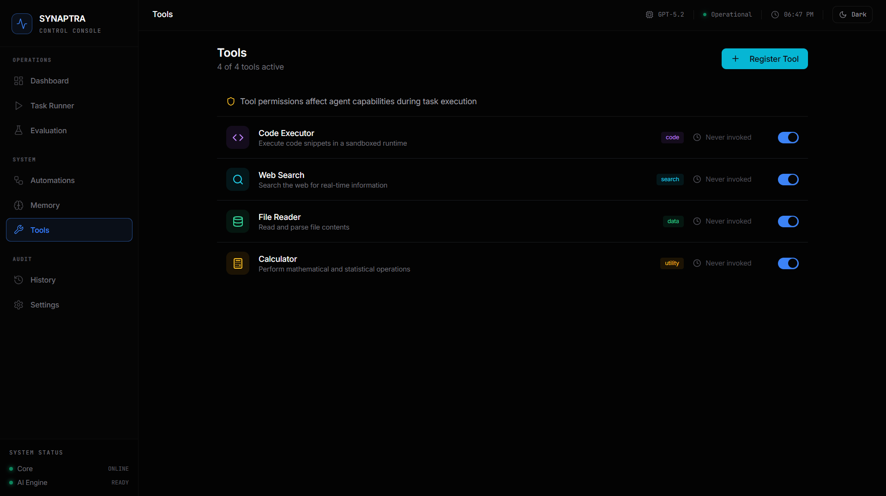
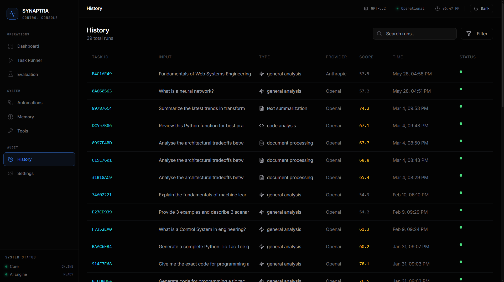

# Synaptra Studio

### Multimodal AI control console — task orchestration, evaluation, and persistent memory.

[](https://github.com/stellaagbim)
[](LICENSE)
[](https://reactjs.org)
[](https://fastapi.tiangolo.com)
[](https://python.org)

[**→ Live Demo (synaptra-studio.vercel.app)**](https://synaptra-studio.vercel.app)

<p align="center">
  
</p>

Synaptra Studio is a web console for running, evaluating, and inspecting AI tasks across multiple providers (OpenAI, Anthropic, Google Gemini). Every task runs through a visible six-stage pipeline, results are scored on five orthogonal metrics, and a typed memory store with vector embeddings lets the agent retain context across runs.

Built with React on the frontend, FastAPI on the backend, and MongoDB for storage.

---

## Platform Overview

### Task Execution Pipeline
Real-time observability into the six-stage execution pipeline with per-step timing and a multi-dimensional evaluation sidebar.

<p align="center">
  
</p>

### Rich Markdown Output
Model responses render as formatted markdown — headings, lists, code blocks, emphasis — styled for both light and dark themes.

<p align="center">
  
</p>

### Evaluation Metrics
Aggregate scoring across five dimensions: Quality, Relevance, Efficiency, Plan Adherence, and Output Coherence.

<p align="center">
  
</p>

### Model Comparison
Per-metric benchmark comparison across models and runs — pick the right model for the job from data, not vibes.

<p align="center">
  
</p>

### Workflow Automations
Reusable workflows with pre-defined prompts, task types, and scheduling.

<p align="center">
  
</p>

### Semantic Memory
Persistent memory store with typed entries (Context, Summary, Artifact, Reference), vector embeddings, and semantic search.

<p align="center">
  
</p>

### Tool Registry
Toggleable capability registry — Code Executor, Web Search, File Reader, Calculator — that gates which actions the agent can invoke.

<p align="center">
  
</p>

### Execution History
Complete audit ledger of every task run with input, type, provider, score, and timestamp — searchable and filterable.

<p align="center">
  
</p>

---

## Features

- **Multi-provider AI** — OpenAI (GPT-4o, GPT-4o-mini, o1), Anthropic (Claude Sonnet 4.5, Claude Haiku 4.5), Google Gemini, all swappable from Settings
- **Six-stage execution pipeline** with per-stage timing and reasoning traces
- **Five-metric evaluation** (Quality, Relevance, Efficiency, Plan Adherence, Coherence) with weighted composite scoring
- **Vector memory** with semantic similarity retrieval and configurable thresholds
- **Reproducible benchmarks** via Evaluation Suites with historical comparison and side-by-side model comparison
- **Workflow automations** — reusable templates triggered manually or on a schedule
- **Multimodal input** — text and vision in a single task pipeline
- **Light / dark / system theming** with localStorage persistence
- **Mobile-responsive layout** with a slide-in sidebar drawer

---

## Quick Start

### Prerequisites

- Python 3.11+
- Node.js 18+
- MongoDB (local or Atlas) — see [§6 below](#mongodb)
- At least one AI provider key (OpenAI, Anthropic, or Gemini)

### Backend

```bash
git clone https://github.com/stellaagbim/synaptra-studio.git
cd synaptra-studio/backend

python -m venv venv
source venv/bin/activate          # Windows: venv\Scripts\activate
pip install -r requirements.txt

cp .env.example .env
# Edit .env — see "Environment Variables" below

uvicorn server:app --reload --host 0.0.0.0 --port 8000
```

API at `http://localhost:8000`, interactive docs at `/docs`.

### Frontend

```bash
cd synaptra-studio/frontend
npm install
npm start
```

App at `http://localhost:3000`.

### Verify

1. Sidebar status indicators should show **Core: ONLINE** and **AI Engine: READY**
2. Open Task Runner, submit a prompt
3. Watch the pipeline execute and the metrics populate

---

## Architecture

```
┌──────────────────────────────────────────────────────────────┐
│   CLIENT  ·  React 18 + Tailwind + Shadcn/UI                 │
│   Dashboard │ Task Runner │ Eval │ Memory │ Tools │ History  │
└──────────────────────────────┬───────────────────────────────┘
                               │ REST (JSON)
                               ▼
┌──────────────────────────────────────────────────────────────┐
│   SERVICE LAYER  ·  FastAPI + Pydantic                       │
│                                                              │
│   Task Orchestrator   Evaluation Engine   Memory Service     │
│   • Input reception   • Quality           • Typed storage    │
│   • Preprocessing     • Relevance         • Vector search    │
│   • RAG retrieval     • Efficiency        • Provenance       │
│   • AI analysis       • Plan adherence    • Linked artifacts │
│   • Evaluation        • Coherence                            │
│   • Output gen                                               │
└─────────────┬──────────────────────────────────┬─────────────┘
              │                                  │
              ▼                                  ▼
   ┌─────────────────────┐         ┌──────────────────────────┐
   │   AI PROVIDERS      │         │   DATA LAYER             │
   │   • OpenAI          │         │   MongoDB collections:   │
   │   • Anthropic       │         │   • tasks                │
   │   • Google Gemini   │         │   • memory               │
   │   (via LiteLLM)     │         │   • eval_suites          │
   └─────────────────────┘         │   • eval_runs            │
                                   │   • automations          │
                                   │   • settings             │
                                   └──────────────────────────┘
```

### Tech Stack

| Layer | Stack |
|---|---|
| Frontend | React 18, React Router v6, Tailwind CSS, Shadcn/UI, react-markdown |
| Backend | FastAPI, Pydantic v2, Motor (async MongoDB driver) |
| AI | LiteLLM (unified client for OpenAI / Anthropic / Gemini), tiktoken |
| Storage | MongoDB 6+ (Atlas or local) |
| Deploy | Vercel (frontend), Render (backend) |

### Request Lifecycle

1. UI submits `POST /api/tasks` with input text (and optional image)
2. Backend creates a task record (`pending`), persists to MongoDB
3. Pipeline runs: input reception → preprocessing → memory retrieval → AI analysis → evaluation → output
4. Result + metrics + reasoning traces saved back to MongoDB
5. UI receives the completed task and renders the markdown output

---

## Configuration

### Environment Variables

**Backend (`backend/.env`):**

| Variable | Required | Description |
|---|---|---|
| `MONGO_URL` | yes | MongoDB connection string (`mongodb://localhost:27017` or Atlas `mongodb+srv://...`) |
| `DB_NAME` | no | Database name. Default: `synaptra_studio` |
| `OPENAI_API_KEY` | one of | OpenAI key (for GPT-4o, o1, etc.) |
| `ANTHROPIC_API_KEY` | one of | Anthropic key (for Claude models) |
| `GEMINI_API_KEY` | one of | Google AI Studio key (for Gemini) |
| `CORS_ORIGINS` | no | Allowed origins. Default: `*`. Set to your frontend URL in production. |

At least one AI provider key is required. The provider list in Settings shows which are active.

**Frontend (`frontend/.env`):**

| Variable | Required | Description |
|---|---|---|
| `REACT_APP_BACKEND_URL` | no | Backend URL. Default: `http://localhost:8000`. Set to your deployed backend URL for production. |

### MongoDB

**Local:**

```bash
# macOS
brew install mongodb-community && brew services start mongodb-community

# Ubuntu
sudo apt install mongodb && sudo systemctl start mongodb

# Windows
winget install MongoDB.Server
```

**Atlas (recommended for production):**

1. Create a free M0 cluster at [cloud.mongodb.com](https://cloud.mongodb.com)
2. **Database Access** → create user
3. **Network Access** → add your IP (or `0.0.0.0/0` for hosted backends)
4. **Connect → Drivers** → copy connection string into `MONGO_URL`

---

## Deployment

This repo ships with `render.yaml` (backend) and `frontend/vercel.json` (frontend).

### Backend on Render

1. Push the repo to GitHub
2. [Render Dashboard](https://dashboard.render.com) → **New → Blueprint** → connect repo
3. Render reads `render.yaml` and prompts for env vars (`MONGO_URL`, AI keys, `CORS_ORIGINS`)
4. ⚠️ If using Atlas, add `0.0.0.0/0` to Network Access (Render IPs aren't fixed)

### Frontend on Vercel

1. [vercel.com](https://vercel.com) → **Add New → Project** → import repo
2. **Root Directory:** `frontend`
3. Add env var: `REACT_APP_BACKEND_URL` = your Render URL
4. Deploy

After both are live, update `CORS_ORIGINS` on Render to your Vercel URL.

---

## API Reference

| Method | Endpoint | Description |
|---|---|---|
| `GET` | `/api/status` | System health and component status |
| `GET` | `/api/providers` | List configured AI providers and models |
| `GET` | `/api/tasks` | List tasks (paginated) |
| `POST` | `/api/tasks` | Create and execute a task |
| `GET` | `/api/tasks/{id}` | Retrieve task details |
| `DELETE` | `/api/tasks/{id}` | Delete task and associated memory |
| `GET` | `/api/eval/suites` | List evaluation suites |
| `POST` | `/api/eval/suites` | Create suite |
| `POST` | `/api/eval/run/{suite_id}` | Execute suite |
| `GET` | `/api/eval/runs` | List historical runs |
| `GET` | `/api/eval/compare` | Compare runs across models |
| `GET` | `/api/automations` | List automations |
| `POST` | `/api/automations` | Create automation |
| `POST` | `/api/automations/{id}/run` | Execute automation |
| `GET` | `/api/memory` | List memory items |
| `POST` | `/api/memory/search` | Semantic search over memory |
| `GET` | `/api/memory/stats` | Memory statistics by type |
| `GET` | `/api/tools` | List registered tools |
| `PUT` | `/api/tools/{id}` | Enable/disable tool |
| `GET` | `/api/settings` | Current system settings |
| `PUT` | `/api/settings` | Update settings |

Interactive OpenAPI docs at `http://localhost:8000/docs` once the backend is running.

---

## Evaluation Methodology

Five metrics are computed per task:

| Metric | What it measures |
|---|---|
| **Quality** | Structural completeness — presence of headings, lists, appropriate length |
| **Relevance** | Semantic alignment between input and output (token overlap) |
| **Efficiency** | Inverse of processing time |
| **Plan Adherence** | Pipeline stages completed vs. total |
| **Coherence** | Linguistic structure — average sentence length within optimal bounds |

Composite score:

```
overall = 0.30·quality + 0.25·relevance + 0.15·efficiency
        + 0.15·plan_adherence + 0.15·coherence
```

Quality and relevance are weighted highest because they reflect what most users actually care about; efficiency and reliability metrics keep the score sensitive to execution health without dominating it.

---

## Troubleshooting

| Symptom | Cause | Fix |
|---|---|---|
| Sidebar shows "AI Engine: not_configured" | No AI provider key in `.env` | Add at least one of `OPENAI_API_KEY`, `ANTHROPIC_API_KEY`, `GEMINI_API_KEY` |
| Sidebar shows "Database: disconnected" | Mongo unreachable | Check `MONGO_URL`; if Atlas, verify Network Access allows your IP |
| Frontend shows "Network Error" | Backend not running | Start uvicorn first |
| `bad auth: authentication failed` from MongoDB | Wrong DB user/password | Update credentials in `MONGO_URL` or reset in Atlas → Database Access |
| `DNS query name does not exist` for cluster | Atlas cluster was deleted/never existed | Recreate cluster, copy new connection string |

---

## Roadmap

**Shipped**
- Multi-provider AI (OpenAI, Anthropic, Gemini) via LiteLLM
- Workflow automations with manual and scheduled triggers
- Vector memory with configurable similarity threshold
- Side-by-side model comparison
- Light / dark / system theming
- Mobile-responsive layout

**Planned**
- Visual workflow designer (drag-and-drop multi-step pipelines)
- Trajectory fidelity metrics for multi-step planning
- Runtime tool integration (web search, code execution, file I/O)
- Multi-provider benchmarking in a single eval run
- PDF/Markdown report export for eval results and task histories

---

## Author

**Stella Agbim** — [@stellaagbim](https://github.com/stellaagbim)

## License

MIT — see [LICENSE](LICENSE).
